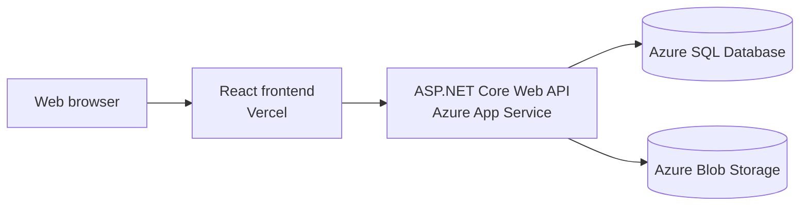

# FRAME CINEMAS

A full-stack cinema web application for an independent film programme, combining a public-facing catalogue with a protected management portal.

The project began as a movie management system and is being developed into a portfolio-ready cinema experience. Visitors can browse films currently showing and upcoming releases, search the catalogue, view film details, and reserve places at scheduled screenings. Administrators can manage films, actors, genres, theatres, screenings, images, and user roles.

## Highlights

### Public experience

- Browse films in theatres and upcoming releases.
- Filter the catalogue and open detailed film pages.
- View upcoming screening times and reserve up to ten places.
- Receive a confirmation credential and manage existing reservations.
- View cinema locations on an interactive Leaflet map.
- Responsive loading, empty, error, and retry states.
- Mobile-safe image URLs for local network development.

### Management portal

- Create, edit, and delete movies, actors, genres, and theatres.
- Schedule and cancel screenings with live capacity tracking.
- Upload and validate movie and actor images.
- Manage administrator roles.
- Protect management routes and API endpoints with JWT authentication and role-based authorization.

### Production readiness

- Request validation, pagination limits, CORS configuration, and authentication rate limiting.
- Liveness and database-readiness health endpoints.
- Local filesystem storage in development and Azure Blob Storage support in production.
- Environment-based configuration with secrets excluded from source control.
- Vercel frontend and Azure API deployment configuration.
- 21 automated frontend and backend tests.

## Architecture



For local development, the API can use an in-memory database and local image storage, so SQL Server and Azure are not required.

## Technology stack

| Area | Technologies |
| --- | --- |
| Frontend | React 19, TypeScript, Vite, React Router, React Hook Form, Yup |
| UI and maps | Bootstrap, Bootstrap Icons, Leaflet, React Leaflet |
| Backend | .NET 10, ASP.NET Core Web API, Entity Framework Core, AutoMapper |
| Data and storage | SQL Server, EF Core In-Memory, Azure Blob Storage |
| Security | ASP.NET Core Identity, JWT, role-based authorization, rate limiting |
| Testing | Vitest, Testing Library, xUnit, ASP.NET Core Test Host |
| Deployment target | Vercel, Azure App Service, Azure SQL Database |

## Repository structure

```text
MoviesAPI/          ASP.NET Core API
MoviesAPI.Tests/    API integration and validation tests
react-movies/       React frontend
DEPLOYMENT.md       Production environment configuration guide
```

## Run locally

### Prerequisites

- Node.js 22.13 or later
- .NET 10 SDK

SQL Server is optional. The default example configuration uses an in-memory database.

### 1. Configure and start the API

Create a local configuration file from the safe example:

```bash
cp MoviesAPI/appsettings.Development.example.json MoviesAPI/appsettings.Development.json
```

In `MoviesAPI/appsettings.Development.json`:

- Replace `jwtkey` with a local secret containing at least 32 bytes.
- Optionally provide `LocalAdmin` credentials for a disposable local administrator.
- Keep `UseInMemoryDatabase` set to `true` for the simplest setup.

Start the API:

```bash
dotnet run --project MoviesAPI --launch-profile http
```

The local API runs at `http://localhost:5231`. In-memory data is reset when the API restarts.

### 2. Configure and start the frontend

In another terminal:

```bash
cp react-movies/.env.example react-movies/.env
cd react-movies
npm ci
npm run dev
```

Set the local frontend environment variable to:

```text
VITE_API_URL=http://localhost:5231/api
```

Open `http://localhost:5173`.

## Tests

Run the frontend test suite:

```bash
cd react-movies
npm test
```

Run the backend test suite from the repository root:

```bash
dotnet test MoviesAPI/MoviesAPI.sln
```

The backend tests use an isolated in-memory database and do not read or modify production credentials or movie data.

## Production build

```bash
cd react-movies
npm run build
cd ..
dotnet build MoviesAPI/MoviesAPI.csproj -c Release
```

See [DEPLOYMENT.md](DEPLOYMENT.md) for the required Vercel and Azure environment settings. Real passwords, JWT signing keys, database connection strings, and storage credentials must be configured in the hosting platforms and must not be committed.

## Project status

The application is under active development. The current version includes a polished cinema programme, protected management workflows, and a reservation MVP with confirmation credentials. A public live demo will be added after deployment.
